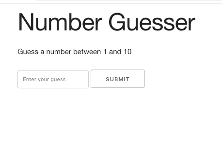

# Number guesser game

A number guessing game where the user has to guess a number. Default the numbers to guess between are 1 and 10 and the user has 3 tries. 

Incorrect number or numbers out of range will give an error message.

Skeleton is used for styling.

## A screenshot

On desktop

## Author
* Albert Stjärne (https://github.com/AlbertStjarne)